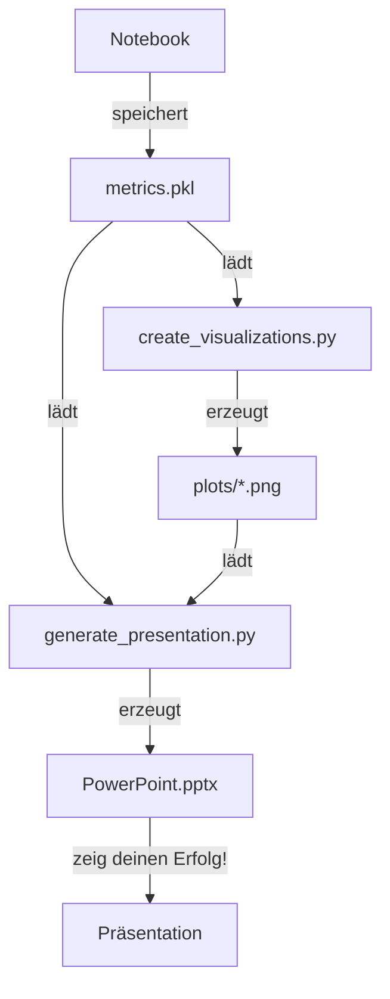

# Quick Start: Metrics → Visualisierungen → PowerPoint

## 📚 Dateien in diesem Projekt

```
16_project_teil_b/Agent/
├── Project_Part_2_Final_Architecture.ipynb  ← HAUPTDATEI (trainiert Modelle)
├── create_visualizations.py                  ← (lädt metrics.pkl, erzeugt PNGs)
├── generate_presentation.py                  ← (lädt metrics.pkl + PNGs, erzeugt PPTX)
├── metrics.pkl                               ← (erstellt vom Notebook, geladen von Scripts)
├── plots/                                    ← (PNGs, erstellt von create_visualizations.py)
│   ├── 01_performance_comparison.png
│   ├── 02_system_architecture.png
│   ├── 03_state_space_components.png
│   ├── 04_reward_function_breakdown.png
│   ├── 05_training_dynamics.png
│   └── 06_model_summary.png
└── Forecast_Augmented_RL_Trading.pptx       ← (PowerPoint, erstellt von generate_presentation.py)
```

---

## 🚀 Los geht's in 3 Commands

### 1️⃣ Trainieren (Notebook)
```bash
jupyter notebook Project_Part_2_Final_Architecture.ipynb
# Kernel → Restart & Run All
# Wartet 40-130 Minuten
# → metrics.pkl wird erstellt
```

### 2️⃣ Visualisierungen erzeugen
```bash
python create_visualizations.py --metrics metrics.pkl --output_dir ./plots
# Wartet 30 Sekunden
# → 6 PNG-Dateien in ./plots/
```

### 3️⃣ PowerPoint erstellen
```bash
python generate_presentation.py --metrics metrics.pkl --images ./plots
# Wartet 5 Sekunden
# → Forecast_Augmented_RL_Trading.pptx
```

---

## 📊 Datenfluss

```
Notebook (trainiert)
     ↓
  metrics.pkl (Binary, ~100KB)
     ↓
create_visualizations.py (lädt metrics.pkl)
     ↓
./plots/*.png (6 Bilder, 300 DPI)
     ↓
generate_presentation.py (lädt metrics.pkl + PNGs)
     ↓
Forecast_Augmented_RL_Trading.pptx (17 Slides mit Bildern!)
```

---

## 🎯 Was jedes Script macht

| Script | Input | Output | Zeit |
|--------|-------|--------|------|
| **Notebook** | BTC-USD Data | `metrics.pkl` | 40-130 min |
| **create_visualizations.py** | `metrics.pkl` | `plots/*.png` | 30 sec |
| **generate_presentation.py** | `metrics.pkl` + `plots/` | `.pptx` | 5 sec |

---

## 💡 Wichtig zu verstehen

**Die Scripts verwenden Daten vom Notebook!**

1. Notebook trainiert & speichert `metrics.pkl`
2. Scripts laden `metrics.pkl` (nicht trainieren selbst!)
3. Scripts nutzen echte Metriken von deinem Training
4. PowerPoint zeigt deine echten Ergebnisse!

---

## ✅ Checkliste

```bash
# 1. Notebook run?
ls -lh metrics.pkl
# → Sollte ~100KB sein

# 2. Visualisierungen erstellt?
ls -lh plots/*.png
# → Sollte 6 Dateien sein

# 3. PowerPoint vorhanden?
ls -lh Forecast_Augmented_RL_Trading.pptx
# → Sollte ~5-10MB sein

# 4. Alle fertig?
open Forecast_Augmented_RL_Trading.pptx
# → Präsentation öffnen und genießen! 🎉
```

---

## 📖 Mehr Info

- **Detaillierter Datenfluss**: Siehe `DATA_FLOW_EXPLAINED.md`
- **Visualisierungen-Details**: Siehe `VISUALIZATION_GUIDE.md`
- **State-Space Dokumentation**: Siehe `STATE_DOCUMENTATION.md`
- **Projekt-Checklist**: Siehe `PROJECT_CHECKLIST.md`

---

## 🆘 Probleme?

### Problem: "metrics.pkl not found"
**Lösung**: Führen Sie das Notebook zuerst aus!
```bash
jupyter notebook Project_Part_2_Final_Architecture.ipynb
```

### Problem: "no such file or directory: plots"
**Lösung**: Führen Sie erst `create_visualizations.py` aus!
```bash
python create_visualizations.py --metrics metrics.pkl
```

### Problem: "Bilder sehen komisch aus"
**Lösung**: Das ist normal mit Default-Werten. Notebook muss laufen!

### Problem: "PowerPoint ist leer"
**Lösung**: `metrics.pkl` muss existieren
```bash
ls -lh metrics.pkl  # Check ob Datei da ist
```

---

## 📝 Workflow-Zusammenfassung



---

**Kurz gesagt**: Notebook → metrics.pkl → Visualisierungen → PowerPoint! 🎯

Alle Daten fließen durch die pickle-Datei! ✨

